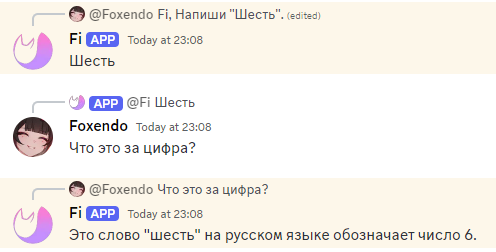
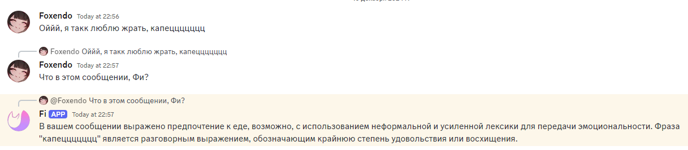
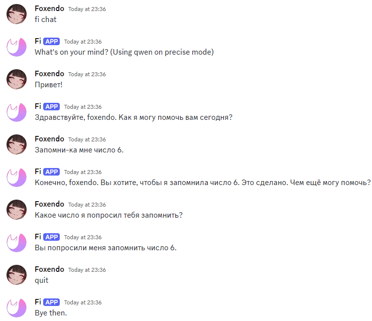

# Это Фи.

Фи - бот, обладающий довольно обширным количеством функций, но основные, так или иначе, связаны с языковыми моделями. Поэтому большая часть этой доки будет именно о них.

Если возникнут вопросы даже после прочтения этой документации, попробуйте посмотреть интересующую вас команду через `fi help (команда)`, или просто введите `fi help`. 

# Содержание
* [Способы общения с Фи](#способы-общения-с-фи)
* [Подкоманды](#подкоманды)
* [Дополнительные умения](#дополнительные-умения)
* [Кастомизация](#кастомизация)
* [Остальные команды с ИИ](#остальные-команды-с-ии)

# Способы общения с Фи
К Фи можно обратиться двумя разными способами, и в одном случае это будет команда, а в другом - _одноразовое_ обращение к языковой модели.

Пример команды: `fi chat` , где `fi` - префикс, а `chat` - команда.

Примеры обращения: `Фи, привет!`, `Hello, Fi.` или `@Fi Че кого?`  
Как видно - обращения всегда через запятую, или уже конкретным упоминанием Фи (через @), иначе она просто проигнорит ваши попытки заговорить.

Но также к Фи можно обратиться ещё двумя способами:
- Ответить на любое сообщение Фи, при этом отметив её. В этом случае она ответит вне зависимости от того, написали ли вы "Фи," или нет. Так же, в данном случае, она учтет контекст того сообщения, на которое вы ответите.

- Ответить на сообщение любого человека, и отметить Фи - либо через @Fi, либо через "Фи,". В этом случае она так же учтет контекст того сообщения, на которое вы отвечаете.

|❗Учтите❗|
|:----| 
| При обращении к Фи любыми способами, кроме как через команду `fi chat`, она не будет помнить ничего, кроме вашего текущего сообщения и сообщения, на которое вы отвечаете (если таковое есть). Поэтому для конструктивного диалога всегда используйте `fi chat`. |

`fi chat` является командой, которая позволяет вам начать диалог с Фи, где она будет помнить все сообщения, а вам не нужно будет никак обращаться к ней по-особенному. Имеется дополнительный аргумент `private` (т.е. полная команда будет звучать как `fi chat private`), при котором вместо того, чтобы начинать диалог на том же канале, где вы находитесь, Фи создаст новый, приватный тред (тему), где вы сможете с ней общаться.

Как видно, Фи помнит все сообщения.  
`quit` здесь служит одной из подкоманд, о которых ниже.

Одна дополнительная возможность `fi chat` в том, что вы можете ответить на какое-либо сообщение Фи (только Фи), написав при этом `fi chat`. Это создаст новый чат, в котором Фи будет помнить то сообщение, на которое вы ответили, и то сообщение, на которое ответила Фи.
К примеру, если вы напишите "Привет", Фи ответит "Здравствуйте", а вы ответите на ее сообщение, написав `fi chat`, то она будет помнить оба этих сообщения, и вы сможете продолжить диалог.

# Подкоманды

|❗Уточнение❗|
|:---|
| Cледующие "обращения" к Фи не относится к двум основным (через префикс `fi` или через запятую), т.к. являются подкомандами. Поэтому используйте их без префиксов, и без запятых. |
| К примеру, в случае с `stop` не пишите `fi stop` или `Fi, stop`, а просто напишите `stop` |

- `regen`: После того, как Фи написала какое-либо сообщение, но оно вам не понравилось по какой-либо причине, вы можете написать `regen`. Сразу после этого, Фи перепишет сообщение.  
(**Примечание**: по умолчанию у Фи стоит достаточно низкая температура (а именно 0.3), поэтому сообщение, скорее всего, не будет сильно отличаться. Об этом позже, в **КАСТОМИЗАЦИИ**.)
Также, отмечу, что перед написанием `regen`, вы можете отредактировать ваше сообщение, после чего Фи учтет изменения в сообщении, и уже, в зависимости от них, может ответить вообще по-другому.

- `stop`: Если Фи очень долго пишет сообщение, и вам надоело ждать, напишите `stop`. Это остановит написание сообщения. Далее вы можете уже написать `regen`, или продолжить диалог с незаконченным сообщением от Фи (действуйте по усмотрению).
  
- `quit` (только в `fi chat`): Если хотите закончить диалог с Фи, напишите `quit`.

# Дополнительные умения

Фи, по умолчанию, умеет только переписываться. Это было сделано для того, чтобы Фи не использовала ненужных инструментов, когда не надо. Это можно поменять (следующая глава, **КАСТОМИЗАЦИЯ**).

Фи умеет смотреть файлы (PDF, TXT, DOCX). Просто прикрепите их вместе со своим сообщением. Учтите, что из-за того, что Фи хостится на видеокарте студента, которая вот-вот сгорит, максимальный контекст (память) Фи был поставлен на 8192. Этого хватит для документа в, примерно, 30000 символов.

Одна из моделей Фи (также, в **КАСТОМИЗАЦИИ**) умеет анализировать картинки. Также пришлите их вместе со своим сообщением, или, если по какой-то причине сами фотографии не присылаются, добавьте ссылку на фотографию в конце сообщения, вот так: `image:(url)`. При этом, все сообщение будет выглядить примерно так: `Фи, посмотри фоточку. image:(url)`. Если текущая модель не умеет анализировать картинки, Фи об этом напишет, попрося поменять на нужную модель.

Также имеются инструменты, такие как **поиск в интернете**, **WolframAlpha** и **интерпретатор кода** (который работает криво (пока-что), поэтому пользуйтесь им только, если вам нужен какой-нибудь график.). Больше о них в следующей главе.

# Кастомизация

Через такие команды как `fi mode`, `fi tools`, `fi personality` можно кастомизировать Фи под себя. Есть еще более глобальная команда, `fi modelswitch`, которая поменяет модель. Она поменяется для всех, т.к вышеупомянутый студент не может позволить себе запускать все модели сразу.

- `fi mode` - Меняет режим, т.е. температуру, т.е "случайность" Фи. Есть 4 режима, от случайного к менее случайному: `very creative` - температура в 5.0, `creative` - температура в 1.5, `precise` - температура в 0.3, и `literal` - температура в 0.1 . Советую использовать только `creative` и `precise`. Можно поменять как написав команду с нужным режимом (`fi mode precise`), так и просто написать `fi mode`, а потом вам выведется список с режимами, и вы напишете только нужную цифру, например `1` (что будет соответствовать `very creative`).
- `fi tools` - Подключает различные инструменты. Они подключаются вводя нужную комбинацию + и -. К примеру, в данный момент порядок такой: поиск, Wolfram, интерпретатор. Если я хочу включить только поиск, я напишу `fi tools +--`. Но так же эту команду можно вводить и без аргументов, просто введя `fi tools`. Потом выведется список со всеми инструментами, и там уже можете ввести нужную комбинацию. (Помните, без `fi`, а просто, условно, `++-`.)  
  - Поиск работает по принципу - Фи ищет нужное количество страниц нужного запроса, далее суммирует всю информацию, выдает вам (с источниками), и запоминает все, что суммировала, сама.
  - Wolfram - просто отсылает какой-либо пример в WolframAlpha, и получает ответ.
  - Интерпретатор кода - работает криво, но Фи старается писать код на Python, и старается получить какой-то вывод. Это может быть число, строка, график, и т.д.
- `fi personality` - Служит для изменения системного промпта (характера) Фи, а так же имени и аватарки под себя. Учтите, что при изменении имени и аватарки, некоторые функции МОГУТ работать криво.  
Просто впишите `fi personality`, а дальше Фи вас проинструктирует.
- `fi modelswitch` - Служит для изменения модели. Введите команду, и вам выдастся список моделей. На данный момент их 3 - Qwen, QwQ и MiniCPM. Qwen - стандартная, работает быстро и хорошо. QwQ - очень медленная, и думает очень долго, но лучше всего решает задачи на логику. MiniCPM - худшая из всех, не поддерживает системный промпт (характер), но может читать картинки, и делает это даже на уровне платных моделей, типа ChatGPT.

# Остальные команды с ИИ
- `fi image (запрос) / (формат (опциональный))` - генерирует картинку, используя [вот этот](https://huggingface.co/spaces/black-forest-labs/FLUX.1-schnell) спейс и модель Flux.1 Schnell. В запрос вписываете что нужно сгенерировать на английском языке, а в размер - формат в форме X:Y. Имеются лимиты на несколько картинок в час.  
  Примеры: `fi image cat / 16:9` сгенерирует кошку в формате 16:9, а `fi image dog` сгенерирует собаку в формате 1:1 (1024x1024)
- `fi web (запрос)` - используя текущую языковую модель, попытается углубленно поискать ответ на ваш вопрос. Отличие от инструмента, которым может пользоваться Фи, в том, что эта команда может занять до 30 минут поиска, т.к будет очень сильно углубляться, пока инструмент займет максимум 5 минут (в среднем 1-2).

Фи также имеет много других команд, не связанных с ИИ (например калькулятор), их вы можете прочекать в `fi help`.
